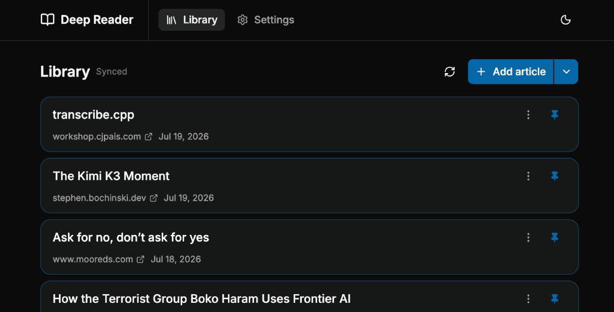
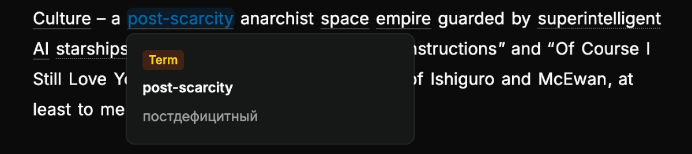
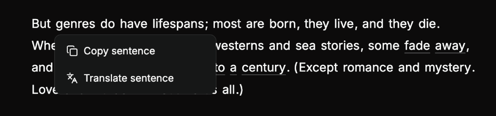

# Deep Reader



A self-hosted app for reading English-language articles with partial AI-assisted translation tuned to your CEFR proficiency level. Add an article URL, let the backend extract and enrich it via an OpenAI-compatible LLM, then read offline on any device — tap words and phrases to get in-context translations without a network connection.

Word translation example:



Sentence translation example:




## Features

- **CEFR-tuned enrichment** — an LLM translates only the words/phrases likely to be unfamiliar at your level, leaving the rest of the text untouched.
- **Translation levels** — words, phrases, sentences.
- **Offline-first reading** — articles are cached locally (PWA + IndexedDB); the reader renders from cache instantly and syncs in the background.
- **Single-user, self-hosted** — one built-in account, created on first launch; no external auth provider required.
- **iOS/Android apps** — the same SvelteKit frontend packaged with CapacitorJS for native offline reading on your own devices.

## Quick start (Docker Compose)

```sh
cp .env.example .env   # set LLM_API_KEY, LLM_API_BASE_URL, at minimum
docker compose up -d
```

Open the app and follow the redirect to `/setup` to create your account (username + password). The service binds to `127.0.0.1:8080`; put a reverse proxy in front for HTTPS — see [docs/nginx.md](docs/nginx.md).

## Documentation

- [DEV.md](DEV.md) — local development, production builds, configuration, testing.
- [docs/MOBILE.md](docs/MOBILE.md) — building and deploying the iOS/Android apps.
- [docs/nginx.md](docs/nginx.md) — reverse proxy and caching configuration.

## License

MIT — see [LICENSE](LICENSE).
