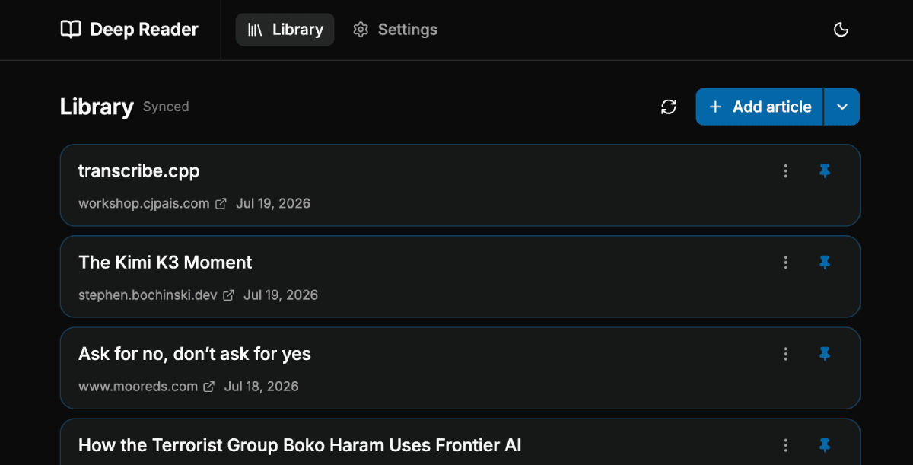
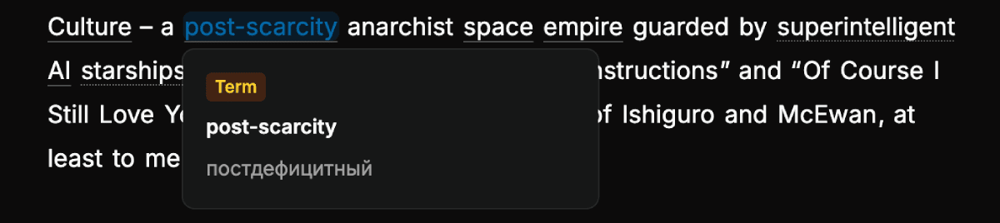
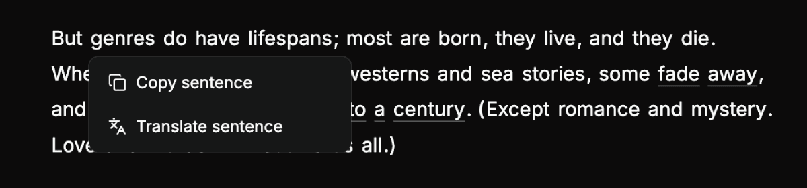

# Deep Reader



A self-hosted app for reading English-language articles with partial AI-assisted translation tuned to your CEFR proficiency level. Add an article URL, let the backend extract and enrich it via an OpenAI-compatible LLM, then read offline on any device — tap words and phrases to get in-context translations without a network connection.

Word translation example:



Sentence translation example:



## Features

- **CEFR-tuned enrichment** — an LLM translates only the words/phrases likely to be unfamiliar at your level, leaving the rest of the text untouched.
- **Translation levels** — words, phrases, sentences.
- **Passive vocabulary capture** — every word or phrase you tap for a translation is collected automatically, matched by dictionary lemma so any inflection counts. The LLM then stops spending attention on words you already know, and the reader hints them from your own vocabulary instead, in every article where they appear. Browse them at `/words`.
- **Publish a translation** — share any translated article under an unguessable link with a lifetime you set (Settings > Public Pages). The page is a standalone file with Open Graph metadata, so link previews work; once the link expires it answers 404.
- **Offline-first reading** — articles are cached locally (PWA + IndexedDB); the reader renders from cache instantly and syncs in the background.
- **Accessible reading** — the whole reader works from the keyboard, translations are language-tagged for screen readers, animation follows your OS "reduce motion" setting, and the font list includes Atkinson Hyperlegible for low vision. See [Accessibility](#accessibility).
- **Single-user, self-hosted** — one built-in account, created on first launch; no external auth provider required.
- **iOS/Android apps** — the same SvelteKit frontend packaged with CapacitorJS for native offline reading on your own devices.

## Accessibility

The reading surface is the product, so it is built to be usable without a mouse,
without motion, and with a screen reader.

**Keyboard.** `Tab` reaches a skip link, then the header, then the article text
itself as a single stop — the reader's marked words behave as one composite
widget rather than thousands of tab stops:

| Key | In the article text |
|---|---|
| `←` / `→` | previous / next marked word |
| `↑` / `↓` | scroll normally (deliberately not captured) |
| `Enter` / `Space` | open the word or phrase translation |
| `Shift+F10` or the Menu key | sentence actions (copy / translate) — the keyboard's right-click |
| `Escape` | close the open panel, keeping your place in the text |

Only marked words take part, exactly as with a click: a plain word does nothing
when tapped, so it is not offered as a stop either.

**Screen readers.** Marked words are exposed as buttons, so a screen reader can
list and jump between them, and the open panel is linked to its word with
`aria-describedby`. Every translated run — word, phrase, sentence, glossary
definition, saved vocabulary — carries the `lang` of your target language, so it
is read with the right voice instead of being spelled out in an English one.

**Vision.** Reader font, size, line spacing and column width are all adjustable
(Settings → Appearance / Reading), with light, sepia and dark themes.
[Atkinson Hyperlegible](https://www.brailleinstitute.org/freefont/), designed by
the Braille Institute for low-vision readers, is offered alongside the serif
faces. Text in the article body meets WCAG AA contrast in all three themes.

**Motion.** With "reduce motion" enabled in the OS, animations collapse and
scroll jumps become instant.

## Quick start (Docker Compose)

```sh
cp .env.example .env   # set LLM_API_KEY, LLM_API_BASE_URL, at minimum
docker compose up -d
```

Open the app and follow the redirect to `/setup` to create your account (username + password). The service binds to `127.0.0.1:8080`; put a reverse proxy in front for HTTPS — see [docs/nginx.md](docs/nginx.md).

## Documentation

- [DEV.md](DEV.md) — local development, production builds, configuration, testing.
- [docs/MOBILE.md](docs/MOBILE.md) — building and deploying the iOS/Android apps.
- [docs/nginx.md](docs/nginx.md) — reverse proxy and caching configuration.
- [WORD-CACHE-ARCH.md](WORD-CACHE-ARCH.md) — design of the vocabulary capture / word cache.

## License

MIT — see [LICENSE](LICENSE).

Third-party components requiring separate attribution — notably the ODbL-licensed
English lemmatization dictionary embedded for vocabulary matching — are listed in
[THIRD-PARTY.md](THIRD-PARTY.md).
